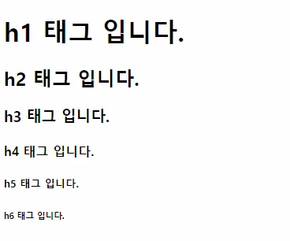
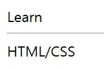
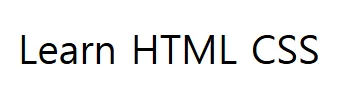
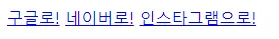

# HTML Tags 살펴보기

<aside>
📌 HTML Tag들이 어떤 것이 있는지 학습합니다.

</aside>

## HTML Tag들의 용도에 따른 분류

### 콘텐츠 구분

1. `h1 ~ h6` 

> 제목을 표시하여, 문서의 논리적 흐름을 나타냅니다.

h1 부터 h6 까지 있으며, h1 은 가장 높은 단계의 제목입니다.

```html
<body>
  <h1>h1 태그 입니다.</h1>
  <h2>h2 태그 입니다.</h2>
  <h3>h3 태그 입니다.</h3>
  <h4>h4 태그 입니다.</h4>
  <h5>h5 태그 입니다.</h5>
  <h6>h6 태그 입니다.</h6>
</body>
```



주의할 점은 브라우저 환경에서 화면과 같이 별도의 CSS 스타일링 없이도 글씨 크기가 달라지는 효과가 있지만, 단순히 글씨 크기를 키우기 위한 용도로 h1 ~ h6 태그들을 사용해서는 안 된다는 점입니다.

h1 ~ h6 태그로 나타내는 제목들은 문서의 논리적 흐름에 따라서 쓰여야 합니다.

문서의 논리적 흐름에 따른 제목 태그들의 사용 예시는 다음과 같습니다.

- 뉴스 주제 : `h1`
    - 경제 : `h2`
        - 금융 : `h3`
        - 부동산
    - 사회 : `h2`
        - 사회 일반
        - 인권/복지
    - 스포츠 : `h2`
        - 축구
        - 농구
        - 야구
        
2. `p`

> 문단(paragraph)을 구분합니다.


```html
<p>Lorem ipsum dolor sit, amet consectetur adipisicing elit.
    Veniam facere facilis numquam molestiae praesentium ad, in obcaecati earum pariatur, 
</p>
<p>Lorem ipsum dolor sit amet consectetur adipisicing elit. 
  Veniam facere facilis numquam molestiae praesentium ad, in obcaecati earum pariatur, 
</p>
```

3. `div` 

> HTML 문서에서 div는 아래의 그림과 같이 하나의 영역을 구분합니다.


```html
<h1>My Webpage</h1>
<!-- 영역 1 -->
<div>
  <h2>Lorem 1</h2>
  <p>Lorem ipsum dolor sit, amet consectetur adipisicing elit.
     Veniam facere facilis numquam molestiae praesentium ad, in obcaecati earum pariatur, 
    accusamus consequatur doloremque, dolores quos expedita! Quo, necessitatibus beatae. Illo, dolor!
    Atque magnam quas tempora aspernatur nesciunt porro quia. Reprehenderit fuga sint sit iste nobis quo modi 
    voluptatem delectus illum veritatis ea nesciunt ut natus suscipit voluptatum, ab rerum molestias? Eaque?
  </p>
</div>
<!-- 영역 2 -->
<div>
  <h2>Lorem 2</h2>
  <p>Lorem ipsum dolor sit amet consectetur adipisicing elit. 
    Veniam facere facilis numquam molestiae praesentium ad, in obcaecati earum pariatur, 
    accusamus consequatur doloremque, dolores quos expedita! Quo, necessitatibus beatae. Illo, dolor!
    Atque magnam quas tempora aspernatur nesciunt porro quia. Reprehenderit fuga sint sit iste nobis quo modi 
    voluptatem delectus illum veritatis ea nesciunt ut natus suscipit voluptatum, ab rerum molestias? Eaque?
  </p>
</div>
```

div 태그 자체는 영역을 구분하는 것뿐, CSS 스타일링 전에는 레이아웃에 영향을 주지 않습니다. div 태그는 부모 요소의 전체 공간을 차지하는 Block Element이며, 기본적으로 해당 행을 꽉 채우게 됩니다.

<aside>
💡 div 만으로는 컨테이너의 성격을 알 수 없으므로, 의미를 명확하게 나타내기 위해 header, nav, section, article, aside, footer 와 같은 Semantic Tag들을 활용하기도 합니다. Semantic Tags는 레슨 4에서 후술합니다.

</aside>

4. `hr` 

> 콘텐츠 사이에 수평선을 표시합니다.

```html
<body>
  <div>Learn</div>
  <!-- 수평선을 표시합니다. -->
  <hr> 
  <div>HTML/CSS</div>
</body>
```




<hr>태그는 닫는 태그가 필요 없는(self-closing) 태그입니다.

### 텍스트 관련

5. `span` 

> 텍스트 콘텐츠를 나타냅니다.
> 

<span> 태그는 텍스트 콘텐츠를 위한 컨테이너입니다. <div> 와 같이 그 자체만으로는 레이아웃에 영향이 없지만 요소를 구성하는 태그에 할당된 공간만 차지하는 인라인 요소라는 점에서 차이가 있습니다. 

```html
<body>
  <span>Learn</span>
  <span>HTML</span>
  <!-- 3번째 span은 영향이 없습니다. -->
  <span></span>
  <span>CSS</span>
</body>
```



6. `a` (Anchor)

> 다른 페이지로 이동할 수 있는 하이퍼링크를 생성합니다.
> 

```html
<a href="https://www.google.com" target="_blank">구글로!</a>
<a href="https://www.naver.com" title="네이버로 갈까요?">네이버로!</a>
<a href="https://www.instagram.com">인스타그램으로!</a>
```



> 속성 정리

| 속성 목록 | 상세 설명 | 속성값 |
| --- | --- | --- |
| href (Hyperlink Reference) | 웹 사이트 주소를 명시 |  |
| target | 열릴 위치를 지정  | _blank,  _self, _top, _parent |
| title | 링크에 마우스 오버시 도움말 설정 |  |

7. `b` & `strong`

> 텍스트를 강조합니다.

```html
<span><b>Learn</b></span>
<span>HTML</span>
<span><strong>CSS</strong></span>
```


8. `i` & `em`

> 기울임체로 만듭니다.
> 

```html
<span><i>Learn</i></span>
<span>HTML</span>
<span><em>CSS</em></span>
```


9. `br`

> 줄바꿈 효과를 줍니다.
> 

```html
<span>
  Porro sunt quaerat magni in, <br> molestiae tempore officiis quas impedit 
  facilis id nobis deserunt laborum <br> reprehenderit est facere nisi necessitatibus deleniti quam?
</span>
```


<br> 태그는 self-closing 태그입니다.

### 목록 생성

1. `li` 

> 리스트의 하위 항목을 표시합니다.
> 

```html
<li>Learn</li>
<li>HTML</li>
<li>CSS</li>
```


2. `ul` 

> 순서가 없는 리스트(Unordered List) 입니다.
> 

```html
<h1>Unordered List</h1>
<ul>
  <li>Learn</li>
  <li>HTML</li>
  <li>CSS</li>
</ul>
```

3. `ol`

> 순서가 있는 리스트(Ordered List) 입니다.
> 

```html
<h1>Ordered List</h1>
<ol>
  <li>Learn</li>
  <li>HTML</li>
  <li>CSS</li>
</ol>
```

### 이미지와 멀티미디어

1. `img` 

> 이미지를 표시합니다.
> 

 태그는 self-closing 태그입니다.

```html

```

| 속성 목록 | 상세 설명 |
| --- | --- |
| src | 이미지 주소를 명시 (외부, 내부 주소 가능) |
| alt | 대체 텍스트 |
| draggable | false 설정 시 마우스로 드래그 불가능 |

<aside>
💡 alt 속성은 스크린 리더 사용자에게 이미지의 설명을 제공합니다.

</aside>

2. `iframe`

> 비디오를 삽입합니다.
> 

```html
<iframe width="560" 
        height="315" 
        src="https://www.youtube.com/embed/D0UnqGm_miA" 
        title="YouTube video player" 
        frameborder="0" 
        allow="accelerometer; autoplay; clipboard-write; encrypted-media; gyroscope; picture-in-picture" 
        allowfullscreen>
</iframe>
```

| 속성 목록 | 상세 설명 |
| --- | --- |
| height | 높이 지정 |
| width | 너비 지정 |
| src | 비디오 주소를 명시 |
| title | iframe 요소 제목 |
| frameborder | 테두리 속성 |
| allow | 허용 여부 |
| allowfullscreen | 전체화면 허용 여부 |