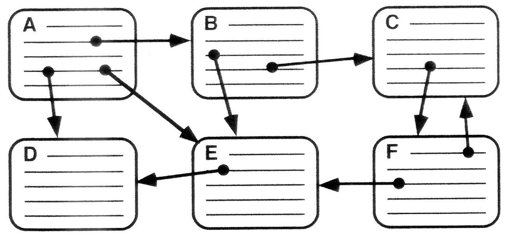

# HTML (Hyper Text Markup Language)

## 하이퍼 텍스트(Hyper Text)
- 순차적으로 접근하여 읽어나가는 일반적인 텍스트와 다르게, 하이퍼텍스트는 링크를 통해 다른 텍스트(문서)로 이동하여 비순차적인 접근이 가능합니다.

## 마크업 언어(Markup Language)
- 문서의 논리적인 구조를 표기 하는 언어입니다.  HTML에서는 태그를 활용하여 문서의 구조를 표기합니다. 일반적으로 데이터를 표기하는데 쓰이기 때문에 HTML은 컴퓨터 시스템에 접근하는 프로그래밍 언어라고 부르지 않습니다.